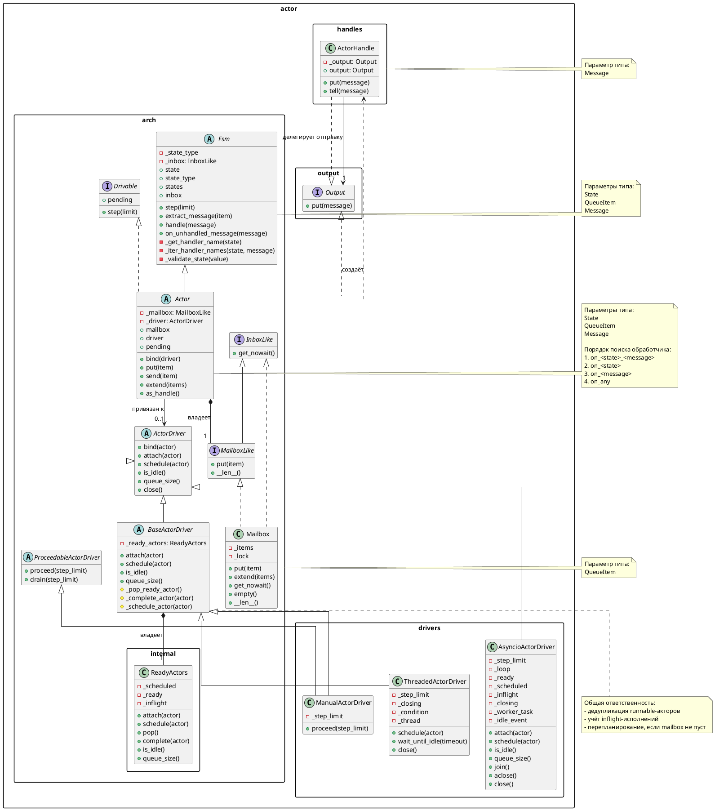

# Архитектура акторов

## Назначение

Эта подсистема строит простую и расширяемую actor-модель на трёх базовых идеях:

- каждый актор сам владеет своим mailbox
- способ запуска акторов вынесен в отдельный драйвер
- связь между акторами идёт через абстракции отправки сообщений, а не через прямые ссылки на объекты

Из этого следуют роли компонентов:

- `Actor` отвечает за состояние, mailbox и обработку сообщений
- `ActorDriver` отвечает за планирование и запуск runnable-акторов
- `Output` и `ActorHandle` отвечают за передачу сообщений между компонентами

## Публичные слои

### `src/actor/arch`

Этот пакет содержит архитектурные контракты и базовую логику:

- `InboxLike`: интерфейс источника входящих сообщений только на чтение
- `MailboxLike`: интерфейс mailbox на запись и получение длины
- `Mailbox`: потокобезопасная реализация mailbox по умолчанию
- `Fsm`: базовая finite-state machine
- `Drivable`: минимальный контракт, который нужен драйверу
- `ActorDriver`: общий интерфейс драйвера
- `ProceedableActorDriver`: интерфейс драйвера с явным `proceed()`
- `BaseActorDriver`: общая логика runnable-очереди
- `Actor`: базовый класс актора

### `src/actor/drivers`

Этот пакет содержит конкретные политики исполнения:

- `ManualActorDriver`: ручной полуасинхронный драйвер
- `ThreadedActorDriver`: driver с worker-thread
- `AsyncioActorDriver`: driver для `asyncio` event loop

### `src/actor/output` и `src/actor/handles`

Здесь находятся абстракции доставки сообщений:

- `Output`: минимальный интерфейс отправки сообщения
- `ActorHandle`: лёгкий объект, через который можно отправлять сообщения в актор

## Жизненный цикл сообщения

1. Отправитель вызывает `put()` или `tell()` на `ActorHandle`, `Actor` или любом другом `Output`.
2. Сообщение попадает в mailbox целевого актора.
3. Если актор привязан к драйверу, актор просит драйвер запланировать себя на выполнение.
4. Драйвер в какой-то момент вызывает `actor.step(step_limit)`.
5. `Fsm.step()` читает сообщения из inbox и диспетчеризует их по обработчикам.
6. Если после текущего запуска в mailbox ещё остались сообщения, драйвер ставит актор на повторный запуск.

## Диспетчеризация обработчиков

Для состояния `IDLE` и сообщения `Ping` порядок поиска обработчика такой:

1. `on_idle_ping`
2. `on_idle`
3. `on_ping`
4. `on_any`

Первый найденный обработчик должен вернуть корректное значение enum-типа состояния.

## Драйверы

### `ManualActorDriver`

Это драйвер для сценариев, где нужен полный контроль над исполнением.

- `schedule(actor)` помечает актор runnable
- `proceed()` запускает один runnable-актор
- `drain()` вырабатывает очередь runnable-акторов до конца

Подходит для:

- unit-тестов
- deterministic simulation
- явного внешнего цикла обработки

### `ThreadedActorDriver`

Этот драйвер содержит один worker-thread и запускает акторы автоматически.

- `schedule(actor)` будит worker при необходимости
- `wait_until_idle()` ждёт завершения всей текущей работы
- `close()` корректно завершает worker-thread

Подходит для случаев, где хочется отделить обработку сообщений от основного потока, но при этом оставить handlers синхронными.

### `AsyncioActorDriver`

Этот драйвер работает поверх конкретного event loop.

- `schedule(actor)` корректно работает и внутри loop, и из других потоков
- `join()` ждёт, пока драйвер станет idle
- `aclose()` завершает worker-task после выработки текущей работы

Подходит для приложений, построенных вокруг `asyncio`.

## Зачем нужен `ActorHandle`

Суффикс `Ref` действительно плохо объяснял смысл объекта. Термин `ActorHandle` точнее: это не "непонятная ссылка", а отдельный объект-дескриптор для отправки сообщений.

`ActorHandle` это:

- лёгкая обёртка над `Output`
- способ отправить сообщение в актор
- способ не зависеть от конкретного объекта актора

Пример:

```python
from enum import Enum, auto

from actor import Actor, ActorHandle, ManualActorDriver


class State(Enum):
    IDLE = auto()
    DONE = auto()


class Start:
    pass


class Pong:
    pass


class Worker(Actor[State, object, object]):
    def __init__(self, reply_to: ActorHandle[object], driver: ManualActorDriver) -> None:
        super().__init__(State, State.IDLE, driver=driver)
        self._reply_to = reply_to

    def on_idle_start(self, message: Start) -> State:
        self._reply_to.tell(Pong())
        return State.DONE


class Collector(Actor[State, object, object]):
    def __init__(self, driver: ManualActorDriver) -> None:
        super().__init__(State, State.IDLE, driver=driver)
        self.messages: list[str] = []

    def on_idle_pong(self, message: Pong) -> State:
        self.messages.append("pong")
        return State.DONE


driver = ManualActorDriver()
collector = Collector(driver)
worker = Worker(collector.as_handle(), driver)

worker.put(Start())
driver.drain()
```

В такой схеме:

- `Worker` знает только про `ActorHandle[object]`
- `Worker` не зависит от конкретного объекта `Collector`
- при необходимости можно заменить транспорт другой реализацией `Output`

## Внутренняя механика `BaseActorDriver`

`BaseActorDriver` содержит общую механику, которую не должны дублировать конкретные драйверы:

- очередь runnable-акторов
- дедупликацию повторного планирования
- учёт inflight-исполнений
- повторную постановку актора, если после `step()` mailbox ещё не пуст

Поэтому конкретные драйверы описывают только способ исполнения:

- вручную
- в фоне через поток
- внутри event loop

## Полная UML-диаграмма

Полный исходник class diagram лежит в [uml/actor_architecture.puml](/home/forthey/projects/DiGr/docs/uml/actor_architecture.puml).

Ниже приведена та же диаграмма в виде PlantUML-кода. В самой диаграмме generic-параметры вынесены в `note`, а не записаны в имени класса. Это сделано специально: такой вариант устойчивее для рендеринга и формально чище, чем попытка кодировать шаблонные параметры прямо в идентификаторе класса.



## Архитектурные решения

- `Actor` не наследуется от mailbox, а владеет им через композицию.
- `Fsm` зависит только от `InboxLike`, поэтому не знает ничего о записи в очередь.
- Драйверы зависят только от `Drivable`.
- `ActorHandle` и `Output` убирают прямую связанность между акторами.
- `BaseActorDriver` централизует очередь runnable-акторов и повторный запуск.

## Пример прикладного использования

Эта actor-архитектура уже используется в подсистеме AST-парсинга `src/document_ast`.

Там actor-слой решает инфраструктурную задачу:

- маршрутизацию сообщений между стадиями пайплайна
- планирование обработки через driver
- отделение прикладной логики разбора от механики исполнения

Сами правила структуры документа при этом задаются не в акторах, а в YAML-конфигурации формата.

Связанные материалы:

- [Архитектура AST-парсера](./ast_parser_architecture.md)
- [Конфигурация AST-парсера](./ast_parser_configuration.md)
- [UML class diagram AST-парсера](./uml/ast_parser_architecture.puml)
- [UML sequence diagram AST-парсера](./uml/ast_parser_sequence.puml)
